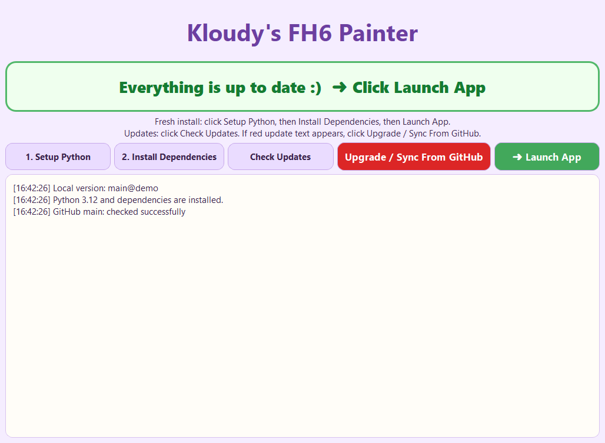
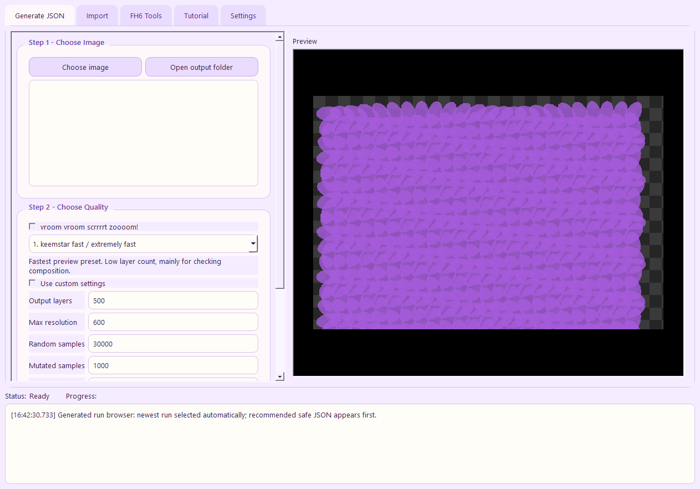
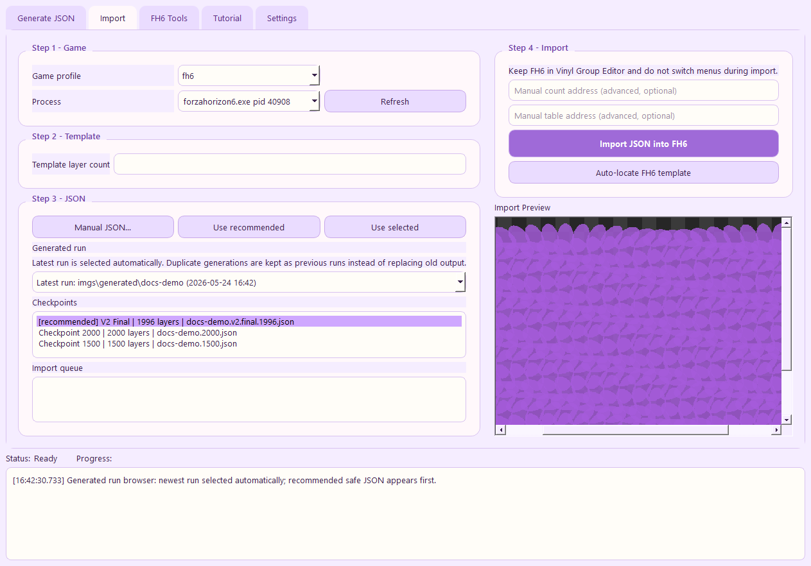

# Kloudy's FH6 Painter

[English](README.md) | [中文](README.zh-CN.md)

Launcher-first final-vinyl builder and FH6 importer for **Forza Horizon 6**.

This project turns an image into finalized, import-ready Forza vinyl JSON, then imports that final JSON into an open FH6 Vinyl Group Editor template.

## New Launcher And App

Start from the launcher. It checks setup state, checks GitHub for updates, runs first-time setup, and launches the painter app from one place.

| Launcher | Painter app |
| --- | --- |
|  |  |

The import tab now works as a finalized-vinyl browser: generated run -> finalized checkpoint -> preview -> import. Duplicate generations are preserved as separate run folders, the newest run is selected automatically, and the best safe final JSON is listed first.



## Thank You / Credits

This project exists because several people and upstream projects did the hard foundational work first. License notices are kept in [LICENSE](LICENSE) and [LICENSE.geometrize-gpu](LICENSE.geometrize-gpu).

| Person / project | Link | Contribution |
| --- | --- | --- |
| AE / A-Dawg#0001 | https://github.com/forza-painter/forza-painter | Original Forza Painter project, MIT-licensed FH import workflow, memory-writing/import foundation, and core geometry-to-vinyl approach. |
| BVZRays / bvz rays | https://github.com/bvzrays/forza-painter-fh6 | FH6-focused desktop fork used as the main upstream for this project, including FH6 UI workflow, importer/locator work, release packaging, documentation updates, and bundled app behavior. |
| zjl88858 / forza-painter-geometrize-gpu | https://github.com/zjl88858/forza-painter-geometrize-gpu | GPU/OpenCL geometrize generator lineage used by the bundled `forza-painter-geometrize-go.exe`. |
| Sam Twidale | https://samcodes.co.uk/ | `geometrize-lib` author; original geometry approximation work credited by the project license. |
| Michael Fogleman | https://github.com/fogleman/primitive | `primitive` author; original primitive-based image approximation library credited by the project license. |
| Sanguk Ko / ree9622 | https://github.com/ree9622 | Korean localization contributor in the BVZRays upstream history. |
| heyitshestia / Kloudy | https://github.com/heyitshestia/kloudys-fh6-painter | This fork: PySide launcher-first workflow, Luma Prep, Finalize Checkpoints, Edge Repair defaults, finalized-run browser, updater batch, Kloudy presets, theme support, and FH6 import safety adjustments. |

## Setup Instructions

Recommended start:

```text
00_launcher.bat
```

For a fresh install, use the launcher buttons in order:

1. `Setup Python`
2. `Install Dependencies`
3. `Launch App`

Manual setup files are still available if you prefer batch files directly:

| Order | File | What it does |
| ---: | --- | --- |
| 0 | `00_launcher.bat` | Opens the setup/update launcher. Use this first if you are unsure. |
| 1 | `01_add_python312_to_path.bat` | Finds Python 3.12, or downloads and installs official 64-bit Python 3.12 if it is missing. Then adds Python and Scripts to PATH. |
| 2 | `02_install_dependencies.bat` | Installs all required Python packages. Run this before opening the app. |
| 3 | `04_start_app.bat` | Starts the launcher/app flow. |
| Optional | `05_check_environment.bat` | Checks whether Python and dependencies are installed correctly. |
| Optional | `03_update_from_github.bat` | Updates app files from GitHub. Close the app before running it. |
| Optional | `99_clean_runtime_data.bat` | Deletes runtime/generated cache data for troubleshooting or packaging. |

Do not open the app before installing Python 3.12 and dependencies. If something fails, run:

```text
05_check_environment.bat
```

Manual Python download if automatic setup fails:
https://www.python.org/downloads/release/python-31210/

## Updating

Use the launcher update button, or use only this file:

```text
03_update_from_github.bat
```

Close the app first. Do not update by dragging random files over the folder. The updater syncs the latest GitHub files and preserves generated/runtime output. If Git is missing, the updater installs PortableGit for the current Windows user automatically.

## What It Does

- Builds finalized Forza-compatible vinyl JSON from PNG, JPG, BMP, and similar image files.
- Uses the bundled patched GPU/OpenCL builder: `forza-painter-geometrize-go.exe`.
- Runs Finalize Checkpoints for scoring, capping, reports, Edge Repair, and previews.
- Imports final JSON into the currently open FH6 vinyl group.
- Stores new runs as `imgs/generated/<job>/finals`, `checkpoints`, `previews`, and `reports`.
- Scans old generated folders on startup so previous finalized runs can still be imported.
- Provides a launcher with setup, dependency checks, update status, and one-click GitHub sync.

## Quick Workflow

1. Install Python 3.12 and dependencies with the batch files above.
2. Open the launcher with `00_launcher.bat`.
3. In `Generate Final Vinyl`, choose one image.
4. Pick a Kloudy preset or tune the run.
5. Leave `Luma Prep` and `Edge Repair` on unless the source looks better without them.
6. Click `Generate Final Vinyl` and wait for Finalize Checkpoints to complete.
7. Open FH6 and go to `Create Vinyl Group` / `Vinyl Group Editor`.
8. Load a template with enough simple layers and ungroup it.
9. In the app, go to `Import`.
10. Select a finalized checkpoint, enter the exact template layer count, and import the final JSON.

Full instructions are in [docs/USER_MANUAL.md](docs/USER_MANUAL.md).

## Important Import Rule

FH6 needs **4 boundary layers** for correct cover/apply behavior.

That means the usable drawable count is:

```text
template layers - 4
```

Examples:

| Template layers | Usable drawable layers |
| ---: | ---: |
| 500 | 496 |
| 1000 | 996 |
| 2000 | 1996 |
| 3000 | 2996 |

If your JSON has more shapes than the usable count, the app trims it during import.

## Active Presets

The app uses a simple speed-to-quality ladder tuned for the patched faster generator:

| Preset | Target layers | Random samples | Mutated samples | Max resolution | Best for |
| --- | ---: | ---: | ---: | ---: | --- |
| Fast & Ugly | 1000 | 45,000 | 2,200 | 900 | Quick composition checks and rough drafts. |
| Okay Draft | 1500 | 100,000 | 5,000 | 1200 | Useful test imports without a long wait. |
| Pretty Good | 2000 | 180,000 | 8,500 | 1500 | Recommended everyday balance. |
| Slow & Beautiful | 3000 | 320,000 | 14,000 | 1750 | Final-quality runs when time matters less. |

Luma Prep is a toggle, so separate Luma preset duplicates were removed. Custom run fields can override layer count, resolution, samples, and finalize points without needing separate preset files.

## Main Features

- **Luma Prep**: default-on preprocess pass. It creates a luma-banded intermediate image before the internal build. Good for anime, flat colors, and sharper value separation. Turn it off for soft gradients.
- **Edge Repair**: default-on finalization cleanup. It tries to clean border mess, transparent holes, fingers, hair gaps, and cutout edges before writing final JSONs.
- **vroom vroom scrrrrt zoooom!**: optional switch. Doubles effort-style numeric settings such as samples while keeping output layers and resolution unchanged.
- **Finalized-run browser**: shows generated run folders and finalized checkpoints from `imgs/generated`, including older runs after restart.
- **Generated-run picker**: keeps duplicate generations separate, selects the newest run automatically, and lists the best safe final JSON first.
- **Launcher/update frontend**: checks Python/dependencies, shows whether GitHub has a newer build, and runs setup/update actions without hunting for batch files.
- **Run reports**: every finalized run writes a report with preset, custom settings, effective settings, toggles, candidates, and selected outputs.

## Examples

Source/result examples are included in [docs/examples/test-finest](docs/examples/test-finest):

| Source | Generated result |
| --- | --- |
|  |  |
|  |  |

## Limitations

- The generator/importer path is currently ellipse-based.
- Full handmade multi-shape import is not feature-complete yet.
- FH6 import requires Windows, FH6 running, and the correct editor state.
- GPU generation requires working OpenCL support from the GPU driver.
- Importing may require running the app as administrator.

## Common Problems

- **The app will not start**: open `00_launcher.bat`, run `Setup Python`, then run `Install Dependencies`.
- **Preview unavailable**: run `02_install_dependencies.bat`; generation/import can still work without preview dependencies.
- **OpenProcess or permission error**: run `04_start_app.bat` as administrator.
- **Game process not found**: start FH6 first, then click refresh in the import tab.
- **Ungroup error even though it is ungrouped**: make sure you are inside Vinyl Group Editor, the layer count is exact, and the active group is the template being edited.
- **Output is blurry**: use more output layers, higher random samples, `Pretty Good` or `Slow & Beautiful`, or a larger template.
- **Output is clipped**: the template does not have enough usable layers.

## License

This project is a derivative of the Forza Painter workflow and keeps the original MIT license notices in [LICENSE](LICENSE) and [LICENSE.geometrize-gpu](LICENSE.geometrize-gpu).
