# KFPS - Kloudy's Forza Painter Suite

## **IMPORTANT UPDATE NOTE FOR VERSIONS BELOW 2.0.10**

**If you are on any version below `2.0.10` and the launcher does not open, do not keep clicking the launcher.**

**Open the `KloudysFH6Painter` folder and run `03_update_from_github.bat` instead.**

**After the update finishes, use the launcher normally again. New downloads from `2.0.10` onward already include the fixed launcher.**

<p align="center">
  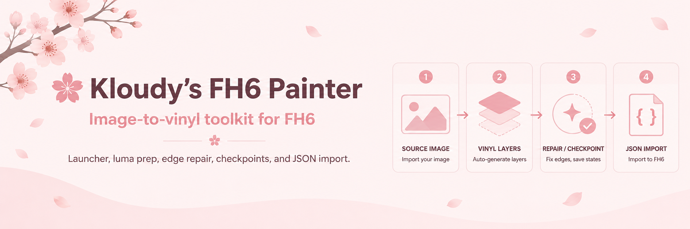
</p>

[English](README.md) | [中文](README.zh-CN.md)

> **NEWS: Experimental Forza Motorsport 8 export support is now available in KFPS.**
>
> FM8 vinyls can now be exported to KFPS JSON, previewed or edited in the KFPS editor, and used as FH6-compatible JSONs. This is still experimental: ungrouped vinyls are safest, some edge-case/community shapes may need more testing, and first in-game previews or thumbnails can look odd until the vinyl is saved and reloaded.

KFPS is a Windows-focused Forza Horizon 6 vinyl suite. It can generate vinyl JSON from source art, finalize and preview import-ready checkpoints, import compatible JSON through one FH6 importer, and open a browser-based editor for manual JSON work.

This page is the start-here guide. The full user manual is in [docs/USER_MANUAL.md](docs/USER_MANUAL.md), and the detailed FH6 template/import guide is in [docs/FH6_IMPORT_GUIDE.md](docs/FH6_IMPORT_GUIDE.md).

## What KFPS Includes

| Feature | What it does |
| --- | --- |
| `Generate Final Vinyl` | Converts PNG/JPG source art into FH6 vinyl JSON using the bundled GPU generator and KFPS finalization pipeline. |
| `Final JSON Browser` | Shows generated runs, finalized checkpoints, previews, scores, and the selected JSON that will be imported. |
| `Import JSON` | Imports generated finals, editor exports, hand-edited JSONs, and exported game JSONs into one prepared FH6 vinyl group template, then trims the in-game layer count. |
| `Editor` | Opens the bundled Fabric-based JSON editor for manual vinyl creation, cleanup, tracing, shape search, favorites, color picking, layer work, guide snapping, and JSON export. |
| `Image Tools` | Collects useful prep links for background removal, browser upscaling, and browser downscaling/compression. |
| `Image Size Helper` | Reads an image, reports resolution/megapixels, and gives same-aspect resize targets from 1 MP to 6 MP. |
| `Launcher + Updater` | Starts the app, checks Python/dependencies, checks GitHub `main`, and syncs updates without manually dragging files around. |

## Optional Ko-fi

KFPS is free, and support is completely optional. If the suite saved you time and you feel like leaving a tiny tip, it would make me very happy and helps with testing time, assets, and maybe someday a proper little logo or mascot.

https://ko-fi.com/O7O020EQNQ

## Why It Is Useful

- One standalone folder can handle setup, updates, generation, previews, imports, and manual JSON editing.
- Generated runs keep raw checkpoints, final checkpoints, previews, reports, and metadata in predictable folders.
- The app focuses on final import files instead of making users dig through raw generator output.
- Source-aware settings keep normal generation simple while still allowing Pro settings for manual tuning.
- FH6 imports use a reusable 3000-layer plain white circle template, then cull the saved layer count down to the imported design.
- The editor is offline and browser-based, so manual shape work can be done outside the in-game editor.
- The image tools and size helper make source preparation part of the same workflow instead of a separate guessing step.

## Manual Editor Highlight

KFPS includes a standalone browser editor for people who want to manually build, repair, trace, or clean up FH6 JSON instead of relying only on automatic generation.

<p align="center">
  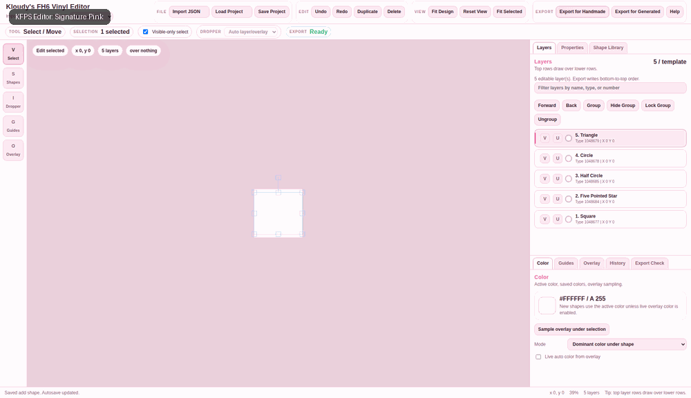
</p>

The editor is designed around practical vinyl work:

- Load generated, exported, or hand-edited JSON and inspect it visually.
- Add FH6 shapes from a searchable in-game-style shape library.
- Favorite common shapes so they stay easy to reach.
- Add a source image overlay for tracing and adjust overlay opacity/size.
- Sample colors from the overlay or existing shapes instead of guessing RGB values.
- Select one layer, box-select many layers, group layers internally, hide/lock groups, duplicate, delete, and reorder.
- Move, stretch, skew, rotate, and nudge shapes with editor controls built for vinyl cleanup.
- Use guides and snapping for cleaner alignment work.
- Save editor projects separately from FH6 export JSON.
- Export JSON back into the KFPS import workflow.

## Download

For normal use, download the latest release zip:

```text
Kloudys-FH6-Painter-<version>.zip
```

The release should contain:

```text
KFPS.exe
Images/
KloudysFH6Painter/
```

The standalone release includes bundled Python 3.12, bundled Python dependencies, the current KFPS generator executable, the app files, the editor files, and update scripts. You should not need to install Python manually when using the full standalone release.

## First-Time Setup

1. Extract the release zip into a normal writable folder such as `Desktop`.
2. Open `KFPS.exe`.
3. Use Settings to verify the bundled Python/runtime if the app reports a problem.
4. Press `Update from GitHub` only when the app says a newer version is available.
5. Start from the Dashboard workflow buttons.

## Main Workflow

1. Put source art into the `Images/` folder next to the launcher.
2. Open the launcher and press `Launch App`.
3. Open `Generate Final Vinyl`.
4. Choose one source image.
5. Choose a preset.
6. Set `Template layers` to the FH6 template size you will import into.
7. Click `Generate Final Vinyl`.
8. Wait until the log says `FINALIZE CHECKPOINTS COMPLETE`.
9. Open `Import JSON`.
10. Select the finalized checkpoint you want.
11. Open FH6, load your reusable 3000-layer plain white circle template, and ungroup it.
12. Click `Import JSON into FH6`.

Generation is not finished when the generator process stops. The import-ready files are ready only after finalization completes.

<p align="center">
  
</p>

## FH6 Template Requirement

The recommended import base is a reusable 3000-layer plain white circle vinyl group.

Create it once:

1. Open FH6 Vinyl Group Editor.
2. Create or load a group containing 3000 simple white circle layers.
3. Save the group.
4. Leave the group editor.
5. Reopen the saved group.
6. Ungroup it before importing.

After that, reuse the same saved/reopened template. KFPS imports into the loaded template and culls the final layer count down to the design that was imported.

The detailed step-by-step version is in [docs/FH6_IMPORT_GUIDE.md](docs/FH6_IMPORT_GUIDE.md).

## Generate Final Vinyl

The generator turns source art into raw checkpoints, then KFPS finalizes those checkpoints into import-ready JSON.

Current stock presets are style-focused:

| Preset | Best for | Notes |
| --- | --- | --- |
| `Shaded Character Art` | anime, characters, hair, faces, mixed soft/hard detail | General default for detailed artwork. |
| `Flat Colors` | stickers, decals, clean color regions, mascot-style art | Prioritizes stronger edge separation and cleaner flat regions. |
| `Smooth Gradients` | soft lighting, glossy shading, blended colors | Keeps transitions smoother and avoids over-sharpening gradients. |

Normal users usually only need:

| Setting | Meaning |
| --- | --- |
| `Template layers` | The FH6 template layer count and target output budget. |
| `Finalize at layers` | Which checkpoints become final import choices, for example `500,1000,1250,1500,2000,2500,3000`. |

Pro settings expose resolution, random samples, mutated samples, source prep, and repair options. Use them when you want manual control, not for normal first runs.

### Source Size Prep

Before generating, use `Image Size Helper` when you are unsure whether the source is too small or unnecessarily huge.

Source size matters:

- Very small images can lose detail before the generator ever sees it.
- Extremely large images can waste time, blur the useful search budget, and make runs slower without improving the final vinyl.
- The best source is usually clean, correctly cropped, transparent where possible, and sized for the preset/layer target.

The helper shows the current pixel size, megapixels, and same-aspect 1 MP through 6 MP resize targets. If the image is too small, use the `2x / 4x Browser Upscaler` link in `Image Tools`. If it is too large, use the `Browser Downscaler / Compressor` link to resize it before generating.

## Final JSON Browser

The importer browser is organized around generated run folders.

```text
Generated run or compatible JSON -> preview -> Import JSON
```

<p align="center">
  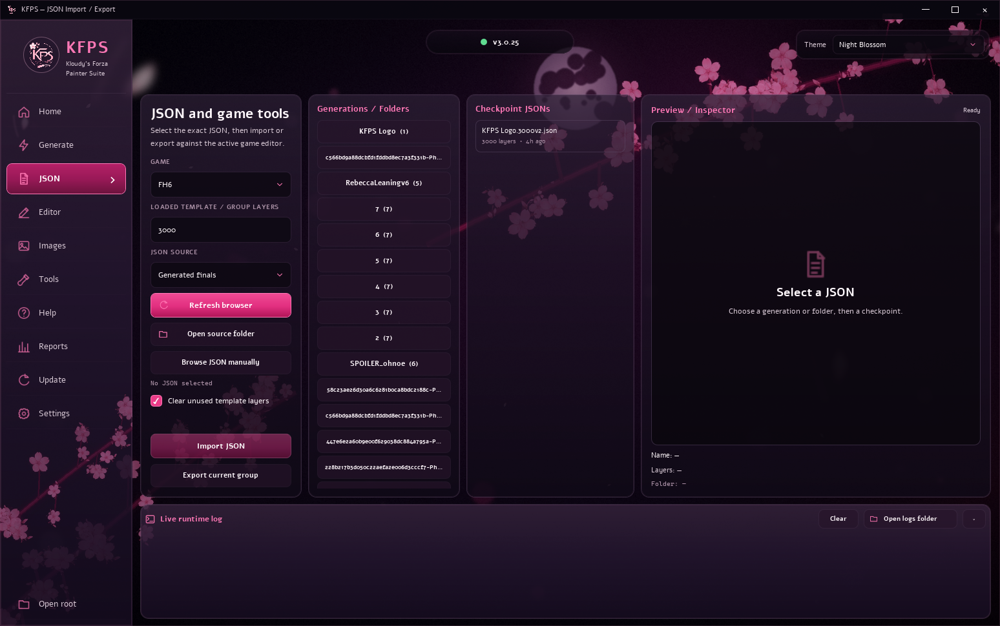
</p>

Use files from:

```text
imgs/generated/<run-name>/finals/
```

Raw checkpoints are kept for reports and debugging. Final checkpoints are the recommended import target.

## Compatible JSON Import

The same `Import JSON` tab handles generated finals and compatible full shape-code JSON files from the editor, game export, or manual tools.

Basic use:

1. Load the reusable 3000-layer template in FH6.
2. Reopen and ungroup it if needed.
3. Open `Import JSON`.
4. Choose the JSON.
5. Import.
6. Save and reload the vinyl group before judging the final result.

<p align="center">
  
</p>

Important limitation: the live FH6 editor preview can display imported shape-code layers incorrectly until the group is saved and reopened. Judge the saved/reloaded group, not the first live refresh.

## Editor

The editor opens a local browser-based Fabric editor for FH6 JSON work. It is meant for manual creation, cleanup, tracing, final touch-ups, and converting compatible JSON into something easier to edit than raw text.

Open it from the app's `Editor` tab:

<p align="center">
  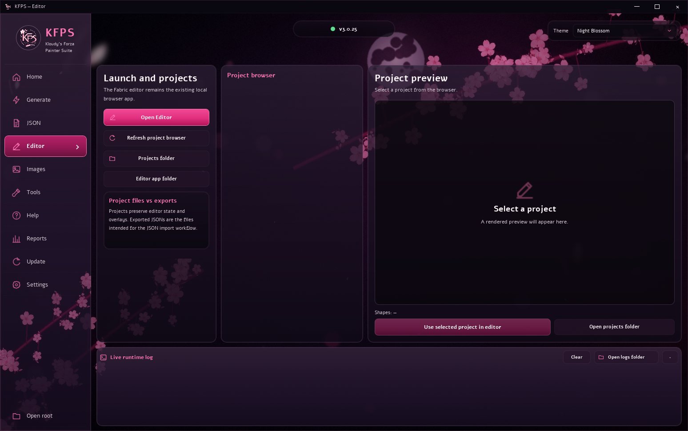
</p>

The full editor opens in a browser window and includes both Signature Pink and Dark themes:

<p align="center">
  
</p>

Detailed still screenshots are kept here: [Signature Pink](docs/screenshots/editor-full-signature-pink.png) and [Dark](docs/screenshots/editor-full-dark.png).

### Editor Workflow

1. Open `Editor` in KFPS.
2. Click `Open Editor`.
3. Import a generated, exported, or hand-edited JSON, or start placing shapes manually.
4. Add a source overlay if you want to trace over art.
5. Search or browse the shape library.
6. Place shapes, sample colors, move/stretch/skew/rotate, and clean up layers.
7. Save a project if you want to continue editing later.
8. Export one FH6-compatible JSON for the KFPS `Import JSON` tab.

### Editor Features

- importing generated, exported, and hand-edited JSON
- placing FH6 shapes from the shape library
- shape search and favorites
- source image overlay for tracing
- color picking from shapes or overlay art
- layer selection, box selection, internal grouping, hiding, and locking
- move, scale, stretch, skew, rotate, nudge, and guide/snap tooling
- visible-only selection for removing top visible cleanup layers without grabbing hidden lower layers
- project save/load for editor sessions
- exporting JSON for generated-style or handmade-style import paths

The editor is offline/export-only. It does not write to FH6 memory.

## Image Prep Tools

The image tools tab gives quick access to common prep tools:

| Tool | Use |
| --- | --- |
| `Background Remover` | Opens PhotoRoom's online background remover. |
| `2x / 4x Browser Upscaler` | Opens a local-in-browser upscaler for small sources. |
| `Browser Downscaler / Compressor` | Opens Squoosh for resizing, format conversion, and compression. |

<p align="center">
  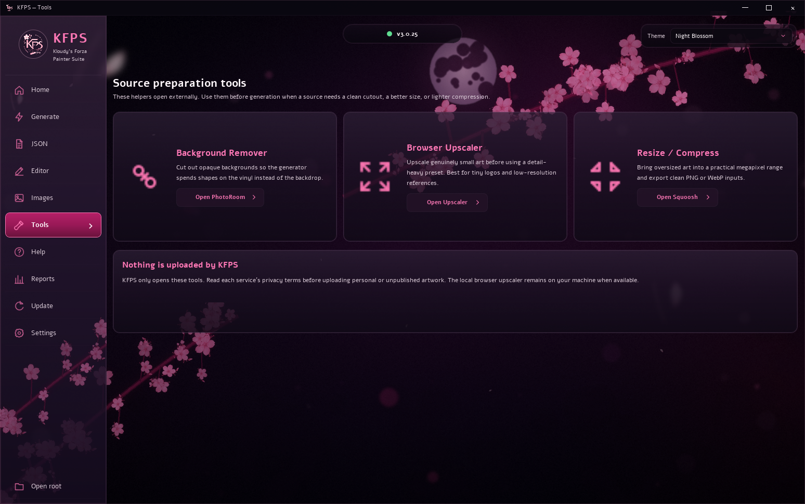
</p>

The app links to these tools. It does not upload images through KFPS itself.

## Image Size Helper

Use this before generation when you want a cleaner source size or when a result looks soft, slow, or under-detailed for the layer count.

The helper shows:

- source width and height
- megapixels
- same-aspect resize targets from 1 MP through 6 MP
- short preset guidance

If the source is too small, upscale it from `Image Tools`. If it is way too large, downscale it from `Image Tools`, then generate again from the cleaned size.

<p align="center">
  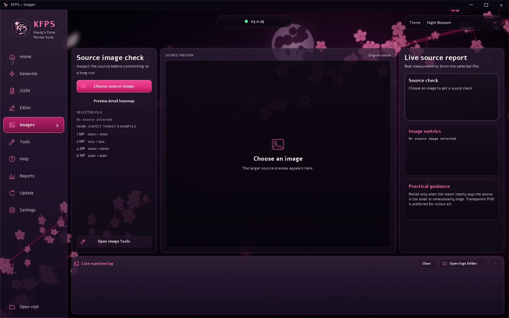
</p>

## Output Folders

Each run creates:

```text
imgs/generated/<job-name>/
```

Inside:

| Folder | Meaning |
| --- | --- |
| `checkpoints/` | raw generator JSONs |
| `finals/` | import-ready finalized JSONs |
| `previews/` | preview PNGs |
| `reports/` | settings, scores, metadata, and finalization reports |

Normal imports use `finals/`.

## Updating

Use the launcher `Update` button or run:

```text
03_update_from_github.bat
```

Close the app, editor, and generator before updating. If a generator process is still running, the updater may stop it before syncing files.

Update logs are stored in:

```text
runtime/update-logs/
```

Backups are stored in:

```text
runtime/update-backups/
```

## Limitations

- FH6 memory import is Windows-only.
- FH6 must be running and must be in the correct Vinyl Group Editor state.
- The recommended import base is a saved/reopened 3000-layer plain white circle template.
- GPU generation requires working OpenCL support from the GPU driver.
- Imported shape-code JSONs may need save/reload before FH6 displays them correctly.
- Results are constrained by FH6 layer limits, available shape types, source quality, and the chosen layer budget.
- KFPS is not an official Forza tool. Use it carefully and keep backups of work you care about.

## Common Problems

| Problem | Most likely fix |
| --- | --- |
| App does not start | Re-extract the full native package into a writable folder and open `KFPS.exe`. |
| Preview unavailable | Use Settings to verify the bundled Python/runtime; re-extract the package if verification fails. |
| GPU/OpenCL error | Install or repair the NVIDIA/AMD/Intel GPU driver so OpenCL is registered. |
| FH6 process not found | Start FH6 and open Vinyl Group Editor before importing. |
| Template not found | Reopen the saved 3000-layer template, ungroup it, and retry. |
| Import looks wrong before saving | Save and reload the vinyl group before judging shape-code imports. |
| Output looks soft | Try a better source, more layers, a different preset, or Pro settings with more search effort. |
| Flat art has halos | Use Flat Colors, transparent source art, and keep edge cleanup enabled. |

More troubleshooting is in [docs/USER_MANUAL.md](docs/USER_MANUAL.md#troubleshooting).

## Examples

These examples show prepared source art next to high-layer final preview output from KFPS.

| Prepared source | High-layer final preview |
| --- | --- |
| 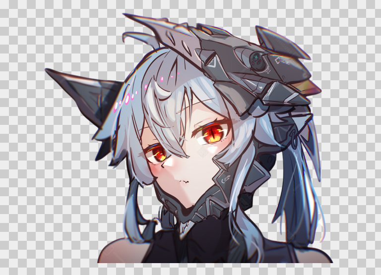 | 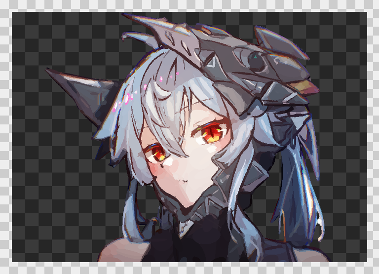 |
| 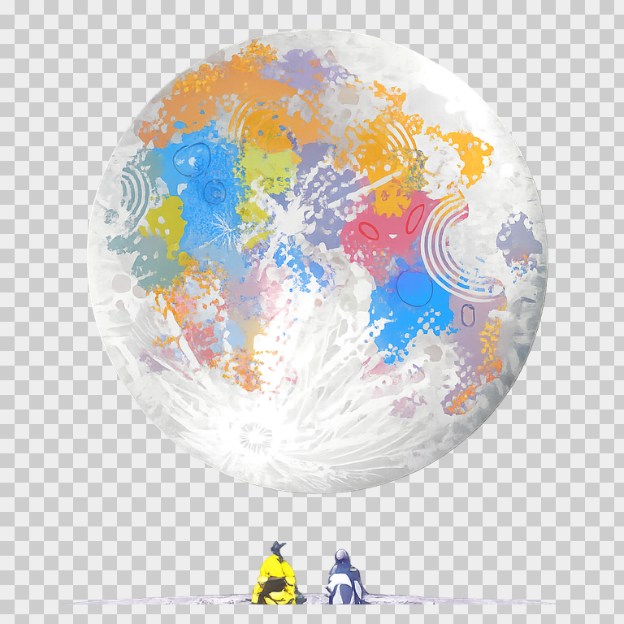 | 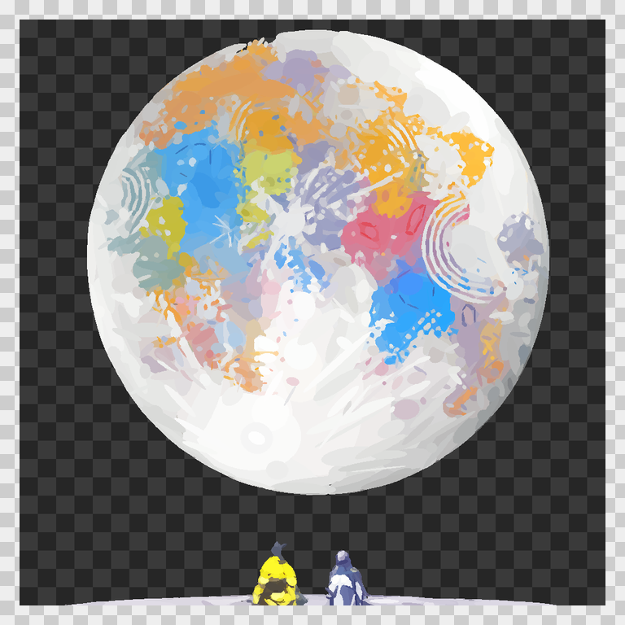 |
| 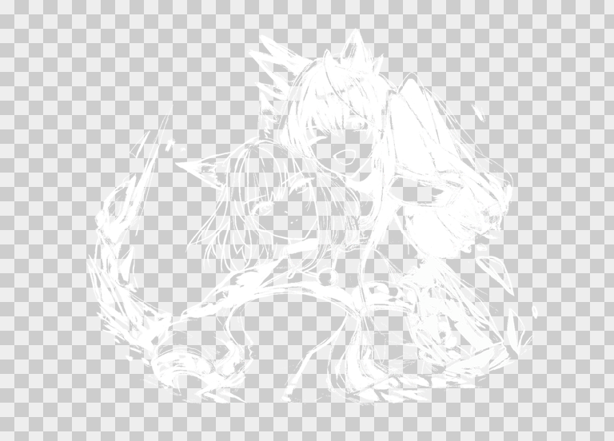 | 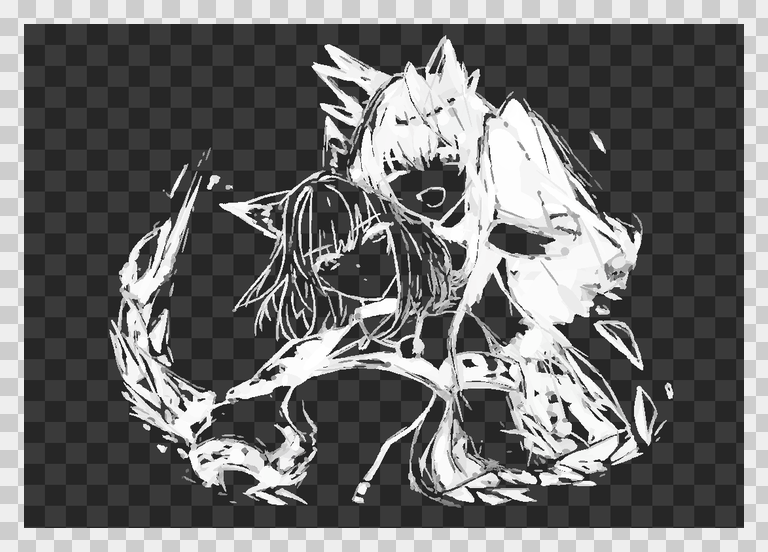 |

Older reference examples are kept below for continuity.

| Source | Generated result |
| --- | --- |
|  |  |
|  |  |

## Community Contributions

A very, very big thank you to LanceMuscles for insights into the deep and almost forgotten lore of Forza Horizon image-to-vinyl generation.

Many more thanks to River, Elu, Wolfie, WKD_Will, Big Nut, Korinthian, Catinus, Soypoka, Slasher, Melon, Eddie, Frozander, Kuroshine, slaigh., Asayunon, and Astral_Cat for suggestions, testing, tips, and solutions.

Thank you to dcinside.com and minnn for the detailed guide coverage and feedback.

## Credits

This project builds on earlier Forza Painter work and keeps license notices in [LICENSE](LICENSE), [LICENSE.geometrize-gpu](LICENSE.geometrize-gpu), [LICENSE.custom-importer](LICENSE.custom-importer), and [LICENSE.fabricjs](LICENSE.fabricjs).

| Person / project | Link | Contribution |
| --- | --- | --- |
| AE / A-Dawg#0001 | https://github.com/forza-painter/forza-painter | Original Forza Painter project, MIT-licensed import workflow, memory-writing/import foundation, and geometry-to-vinyl approach. |
| BVZRays / bvz rays | https://github.com/bvzrays/forza-painter-fh6 | FH6-focused desktop work, importer/locator behavior, UI/package workflow ideas, and upstream FH6 experimentation. |
| Fabric.js | https://fabricjs.com/ | Canvas editing library used by the bundled browser editor. |
| zjl88858 / forza-painter-geometrize-gpu | https://github.com/zjl88858/forza-painter-geometrize-gpu | GPU/OpenCL generator lineage used by the bundled generator workflow. |
| Community FH5 shape-code spreadsheet | https://docs.google.com/spreadsheets/d/1zmdme-c1ZqxTw8dd-ooYhJV8aOSYc1LkZlmIfELRbqo/edit#gid=0 | Shape-code ordering and names used as the starting point for FH6 registry work. |
| Frozander | Discord | Practical page/offset observations that helped validate FH6 shape registry inference. |
| Community testers | Discord | Templates, screenshots, crash reports, save/reload checks, and import validation. |
| Sam Twidale | https://samcodes.co.uk/ | `geometrize-lib` author; original geometry approximation work credited by upstream license notices. |
| Michael Fogleman | https://github.com/fogleman/primitive | `primitive` author; original primitive-based image approximation library credited by upstream license notices. |
| Sanguk Ko / ree9622 | https://github.com/ree9622 | Korean localization contributor in upstream history. |
| heyitshestia / Kloudy | https://github.com/heyitshestia/kloudys-forza-painter-suite | KFPS suite workflow, launcher, PySide app, presets, finalization, browser UI, updater, packaging, FH6 safety adjustments, layer culling, editor integration, and FH6 handmade/import tooling. |

## Theme Showcase

KFPS includes multiple visual themes for the app.

<p align="center">
  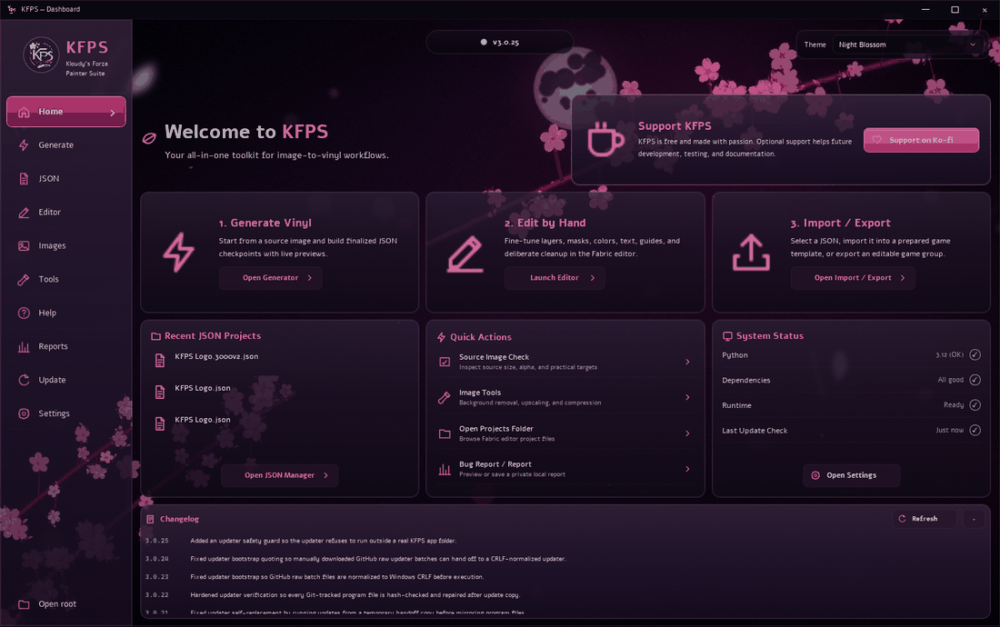
</p>

## Discord

Discord: https://discord.gg/Mu2nUqVt3j

Please read the guide before asking for help. This project assumes basic Windows, file, and FH6 editor familiarity.

## License

KFPS is a derivative of the Forza Painter workflow and keeps the original MIT license notices in [LICENSE](LICENSE) and [LICENSE.geometrize-gpu](LICENSE.geometrize-gpu).

The custom handmade/import tooling is MIT-licensed with its own attribution notice in [LICENSE.custom-importer](LICENSE.custom-importer).

The bundled Fabric.js library is covered by [LICENSE.fabricjs](LICENSE.fabricjs).
