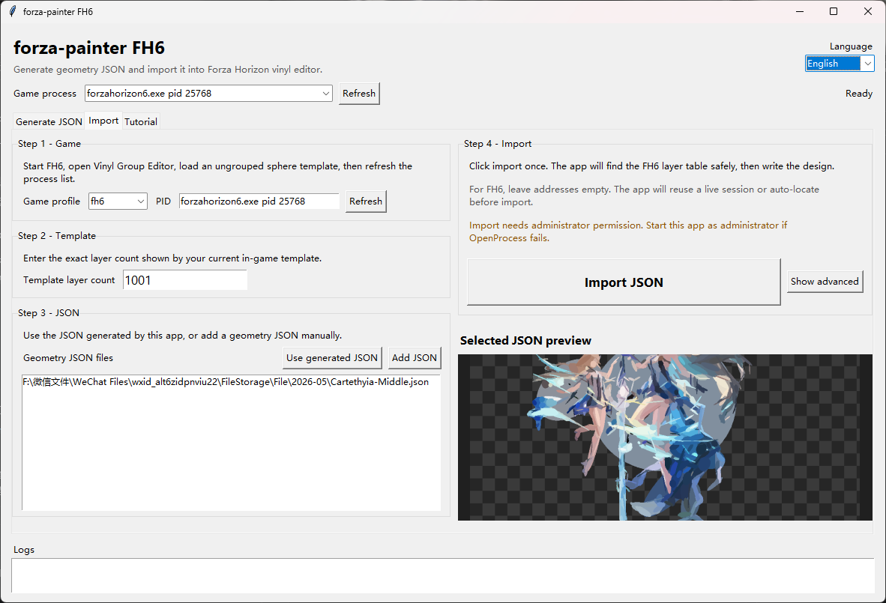
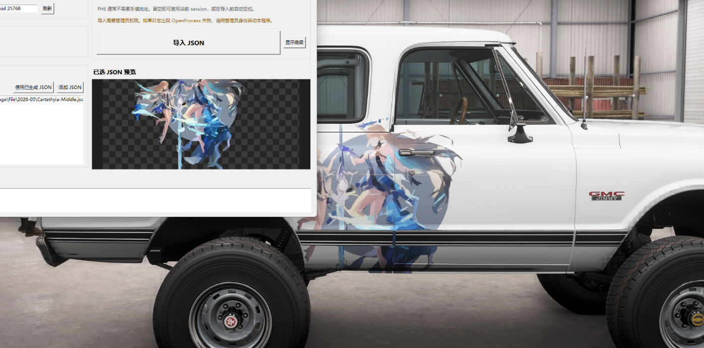

# Kloudy's FH6 Painter

[English](README.md) | [中文](README.zh-CN.md)

FH6-focused image-to-vinyl workflow for **Forza Horizon 6**.

This fork combines:

- a desktop app for generation, preview, import, and FH6 tools
- a bundled GPU/OpenCL ellipse generator
- FH6-safe import logic
- V2 checkpoint selection, pruning, and optional targeted repair

This is a derivative of the original `forza-painter` workflow and keeps the original license notices in [LICENSE](LICENSE) and [LICENSE.geometrize-gpu](LICENSE.geometrize-gpu).

## What This Fork Changes

Compared with the older public `forza-painter` package flow, this repo is centered around:

- **FH6 import** instead of FH4/FH5
- a **desktop Python app** instead of mainly drag-and-drop helpers
- the bundled **GPU/OpenCL generator** `forza-painter-geometrize-go.exe`
- **V2 generation orchestration** in [forza_generator_v2.py](forza_generator_v2.py)
- FH6-specific tooling such as:
  - layer table auto-locate
  - diagnostics
  - shape dumping
  - importer experiments

## Preview

### App Import Page



### Template Ready In FH6


### Imported Result


### Applied To Car



## Quick Start

1. Download or clone this repository.
2. Install 64-bit Python. Python `3.12` is recommended.
3. Run:

```text
install_dependencies.bat
start_app.bat
```

4. In FH6, open `Vinyl Group Editor`, load a simple sphere template, then `Ungroup` it.
5. Generate JSON in the app.
6. Open `Import`, enter the exact template layer count, then import the selected JSON.

If the app does not start, run:

```text
check_environment.bat
```

## What The App Does

This project has two main jobs:

1. Generate geometry JSON from an image.
2. Import that JSON into the currently open FH6 vinyl group.

The normal workflow does **not** require typing memory addresses manually.

## Generator Stack

Generation in this repo is split into two layers:

### 1. Raw generator

The bundled raw generator is:

```text
forza-painter-geometrize-go.exe
```

It is the OpenCL/GPU generator from [vendor/forza-painter-geometrize-gpu-patched](vendor/forza-painter-geometrize-gpu-patched), not the older CPU-first path.

Important raw-generator traits:

- GPU/OpenCL evaluation
- ellipse-only primitive search
- transparent PNG awareness
- local delta-error updates instead of full-image recompute

### 2. V2 wrapper

The app does not call the raw generator directly. It runs it through:

- [forza_generator_v2.py](forza_generator_v2.py)

V2 adds:

- overshoot generation
- checkpoint collection
- optional pruning to the target drawable count
- optional targeted repair
- FH6 boundary-layer awareness

## Preset Families

The current preset system is not the old `extremely fast / fast / balanced / slow / super slow` set anymore.

The main bundled families are:

- **Anime Livery**
- **Ultra Sharp**
- **Smart Detail**
- **Soft Detail**

Each family currently has:

- `1000`
- `2000`
- `3000`

variants, and many of them also have a:

- **Luma Bands**

variant.

### Preset Intent

- **Anime Livery**
  - strongest silhouette-first behavior
  - best fit for flat-color anime, decal, and livery-style cutouts
- **Ultra Sharp**
  - most aggressive edge/detail bias
  - good for harder edges and cleaner line separation
- **Smart Detail**
  - middle ground
  - general-purpose choice when you do not want the extremes
- **Soft Detail**
  - smoother and less aggressive
  - better for gentler transitions, worse for very hard cutouts

### Common bundled 3000-layer presets

| Preset | Random samples | Mutated samples | Max resolution | Shape mode | Preprocess |
| --- | ---: | ---: | ---: | --- | --- |
| Anime Livery 3000 | 34000 | 2600 | 1350 | `mixed_edge_bias` | none |
| Anime Livery 3000 + Luma Bands | 34000 | 2600 | 1350 | `mixed_edge_bias` | `luma_bands` |
| Ultra Sharp 3000 | 45000 | 3500 | 1400 | `mixed_edge_bias` | none |
| Smart Detail 3000 | 36000 | 2800 | 1350 | `mixed_smart_detail` | none |
| Soft Detail 3000 | 30000 | 2400 | 1300 | `mixed_soft_detail` | none |

Settings live in [settings](settings).

## What Luma Bands Actually Is

`Luma Bands` is a **preprocess pass**, not a different primitive engine.

What it does:

1. takes the source image
2. quantizes/bands the luminance channel
3. keeps the original alpha
4. sends that preprocessed image into the normal generator pipeline

In other words, it is closer to:

- “generate from a luma-banded intermediate PNG”

than:

- “change the raw shape solver”

This is controlled by:

- `v2PreprocessMode = luma_bands`

in the preset `.ini` files.

Use it when:

- flat-value separation matters more than soft shading
- you want cleaner region separation
- the source has noisy or mushy midtones

Avoid it when:

- the image depends on subtle soft gradients
- the banding itself makes the source look worse

## What Targeted Repair Does

`Targeted repair` is an **optional V2 post-pass**.

It does **not** change the raw generator during the initial search.

It runs after a candidate has already been selected and pruned, then:

- finds locally bad shapes
- focuses on edge spill, transparent-hole problems, and poor local fit
- tries small edits like:
  - move
  - shrink
  - small rotation changes
  - alpha reduction
- keeps only improvements

What it is good for:

- transparent cutouts
- awkward halos
- border cleanup
- reducing obviously over-fat blobs near holes or edges

What it is **not**:

- a replacement for good presets
- a replacement for enough random samples
- a new primitive type

Current default state:

- all bundled presets ship with:
  - `v2EnableRepair = false`
- the app checkbox is off by default

So repair is available, but it is **not active unless you turn it on**.

## Generate JSON

1. Open the `Generate JSON` tab.
2. Choose one image.
3. Select a preset.
4. Optional: enable `Targeted repair`.
5. Click `Generate with current settings`.
6. Watch the preview and logs.

Generated JSON goes under [imgs/generated](imgs/generated), grouped by source image hash.

The import page and checkpoint browser can then pick up:

- raw checkpoints
- V2 outputs
- final previews

## How To Pick A Good Output

This repo is intentionally built around checkpoint choice.

General rule:

- use the **highest layer count that still looks clean**
- do not assume “more shapes is always better”

Often:

- a mid checkpoint may look cleaner than the very last raw checkpoint
- V2 may prefer a smaller cleaned checkpoint over a later noisier one

If the import looks blurry:

- you probably used too few shapes
- or imported a small checkpoint into a large template

If the import looks heavy or muddy:

- the preset is wrong for the source
- or the source should use a Luma Bands variant
- or the shape count ran past the image’s useful detail budget

## Prepare FH6

1. Start Forza Horizon 6.
2. Open `Create Vinyl Group` / `Vinyl Group Editor`.
3. Load a template built from many simple sphere layers.
4. `Ungroup` it.
5. Keep the editor open while importing.
6. Remember the exact layer count shown in-game.

Recommended template range:

- `500` to `3000` layers

Important FH6 rule:

- FH needs **4 reserved boundary layers** for correct cover/apply behavior

So:

- a `2000` template gives about `1996` drawable layers
- a `3000` template gives about `2996` drawable layers

## Import JSON

1. Open the `Import` tab.
2. Click `Refresh` and select the running `forzahorizon6.exe`.
3. Enter the current in-game template layer count.
4. Add a JSON file, or use one of the generated V2 outputs.
5. Leave advanced addresses empty unless you know exactly what you are doing.
6. Click `Import JSON`.

The app attempts to locate and verify the current FH6 layer table before writing.

If the target cannot be verified safely, it stops before writing.

## FH6 Rules

- The template must be ungrouped.
- The layer count in the app must exactly match the game.
- Do not switch menus while importing.
- After restarting the game, reloading the template, or changing layer count, import again with the new correct count.
- If JSON has fewer layers than the template, unused template layers are hidden.
- If JSON has more layers than the template, extra shapes are trimmed.
- Transparent PNG backgrounds are not imported as visible backgrounds.

## Troubleshooting

### GPU Generator Or OpenCL Error

Update the NVIDIA/AMD/Intel graphics driver.

The bundled generator is:

```text
forza-painter-geometrize-go.exe
```

and it uses OpenCL.

### Python Or Dependency Error

Run:

```powershell
install_dependencies.bat
```

Then:

```powershell
check_environment.bat
```

### `_ARRAY_API not found`, NumPy, Or OpenCV Error

That is an optional preview dependency problem.

It does **not** block:

- JSON generation
- FH6 import

Reinstall core requirements first:

```powershell
python -m pip install -r requirements.txt
```

### `OpenProcess` Or Permission Error

Run `start_app.bat` as administrator.

Generation usually does not need admin rights. Import usually does.

### No Safe Template Found

Check:

- FH6 is still open
- you are still inside Vinyl Group Editor
- the template is ungrouped
- the layer count is exact

### Import Looks Cut Off

The template does not have enough layers.

Use a larger template, or generate fewer drawable layers.

## Included Files

Most users only need:

- `install_dependencies.bat`
- `start_app.bat`
- `check_environment.bat`
- `clean_runtime_data.bat`
- `1. drag_image_file_here.bat`

Main source files:

- [app.py](app.py)
- [main.py](main.py)
- [forza_generator_v2.py](forza_generator_v2.py)
- [generator_backend.py](generator_backend.py)
- [fh6_probe.py](fh6_probe.py)

## Credits

This repo is a modified derivative of:

- original `forza-painter`
- the bundled geometrize/OpenCL generator project credited in [LICENSE.geometrize-gpu](LICENSE.geometrize-gpu)

Original and upstream work should still be credited when redistributing this project.
