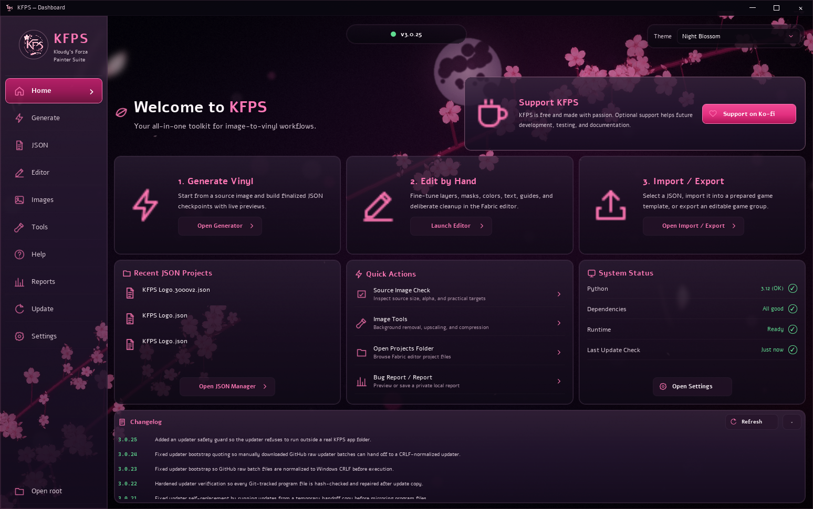
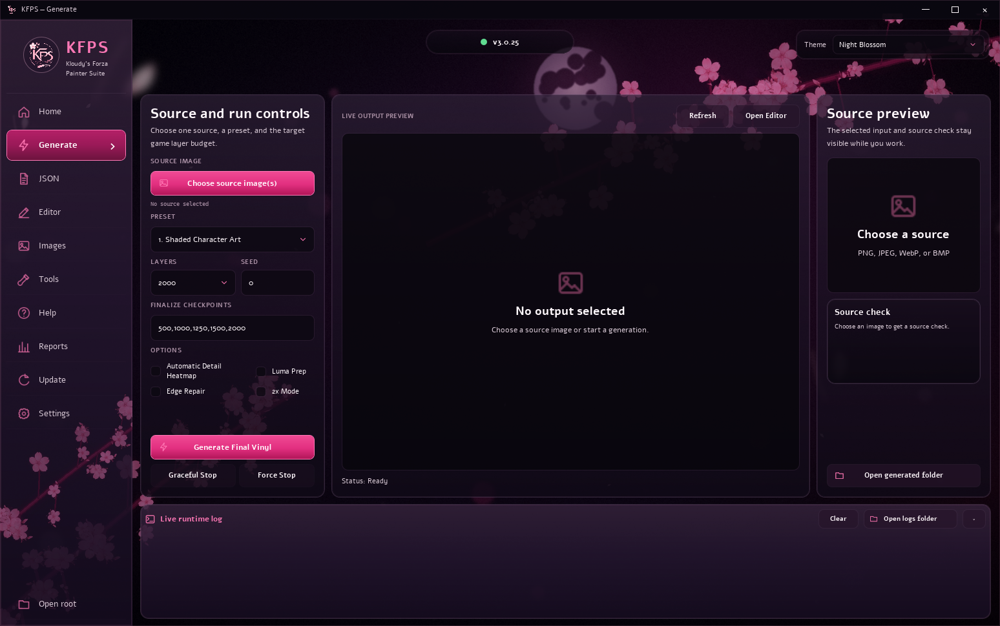

# KFPS User Manual

This is the full manual. It is intentionally detailed so a first-time user can follow it without guessing.

Use this with:

- [README.md](../README.md) for the short start-here guide.
- [FH6_IMPORT_GUIDE.md](FH6_IMPORT_GUIDE.md) for the extra detailed FH6 group/template/import instructions.

## Table Of Contents

1. [What The App Does](#what-the-app-does)
2. [Standalone Folder Layout](#standalone-folder-layout)
3. [First-Time Setup: Press Buttons Left To Right](#first-time-setup-press-buttons-left-to-right)
4. [Launcher Explained](#launcher-explained)
5. [Generate Final Vinyl: Simple Workflow](#generate-final-vinyl-simple-workflow)
6. [Generate Final Vinyl: Every Control Explained](#generate-final-vinyl-every-control-explained)
7. [Generation Phases](#generation-phases)
8. [Presets Explained](#presets-explained)
9. [Automatic Settings And Pro Settings](#automatic-settings-and-pro-settings)
10. [Luma Prep](#luma-prep)
11. [Edge Repair](#edge-repair)
12. [2x Sample Goblin](#2x-sample-goblin-slower)
13. [Final JSON Browser](#final-json-browser)
14. [Import JSON](#import-json)
15. [Editor Tab](#editor-tab)
16. [Image Tools Tab](#image-tools-tab)
17. [Image Size Helper Tab](#image-size-helper-tab)
18. [Settings And Themes](#settings-and-themes)
19. [Files And Folders](#files-and-folders)
20. [Updating](#updating)
21. [Troubleshooting](#troubleshooting)
22. [Deep Reference](#deep-reference)

## What The App Does

KFPS, short for Kloudy's Forza Painter Suite, has two major jobs:

1. Convert source art into finalized Forza vinyl JSON.
2. Import a finalized JSON into an open Forza Horizon 6 Vinyl Group Editor template.

It also bundles an optional offline editor for manual FH6 JSON creation/export.

The app does not magically edit a livery from outside the game. FH6 must be running, you must be in the correct editor screen, and the recommended reusable base is a saved/reopened 3000-layer plain white circle template.

The normal flow is:

```text
source image -> raw generation -> finalization -> final JSON -> FH6 import
```

The files you usually care about are final JSONs inside:

```text
imgs/generated/<job>/finals/
```

## Standalone Folder Layout

After extracting the release zip, the folder should look roughly like this:

```text
Kloudys Painter Standalone/
  Kloudys Painter Launcher.exe
  Images/
    PUT_SOURCE_IMAGES_HERE.txt
  KloudysFH6Painter/
    00_launcher.bat
    01_add_python312_to_path.bat
    02_install_dependencies.bat
    03_update_from_github.bat
    04_start_app.bat
    05_check_environment.bat
    app_qt.py
    launcher_qt.py
    KloudysGalateaGenesis.exe
    python/
    settings/
    tools/
```

Important folders:

| Folder | Purpose |
| --- | --- |
| `Images/` | Put source images here. The source-image chooser opens this folder first. |
| `KloudysFH6Painter/` | The app files. Do not randomly move individual files out of this folder. |
| `KloudysFH6Painter/python/` | Bundled Python runtime in standalone releases. |
| `KloudysFH6Painter/tools/forza-vinyl-studio/` | Bundled offline JSON editor opened from the Editor tab. |
| `KloudysFH6Painter/imgs/generated/` | Generated runs. Created after using the app. |
| `KloudysFH6Painter/runtime/` | Logs, cache, update backups, custom presets. Created by the app. |

## First-Time Setup: Press Buttons Left To Right

For first use, open:

```text
Kloudys Painter Launcher.exe
```

Then press the launcher buttons from left to right before trying to use the app.



Numbered areas:

1. `Setup Python`
2. `Install Dependencies`
3. `Update`
4. `Launch App`
5. Status/log area

### Step 1: Setup Python

Click:

```text
Setup Python
```

What this is for:

- Ensures the app can use 64-bit Python 3.12.
- If the standalone bundled Python exists, the launcher can use that.
- If system Python is needed, the setup helper can install official 64-bit Python 3.12 and add it to PATH.

Expected good result:

```text
Python 3.12 and dependencies are installed.
```

or a launcher status that says Python is usable.

If it fails:

- Close the app.
- Run `01_add_python312_to_path.bat` from inside `KloudysFH6Painter/`.
- Re-open the launcher.

### Step 2: Install Dependencies

Click:

```text
Install Dependencies
```

What this installs:

- PySide6 for the app and launcher UI.
- Pillow for image loading.
- NumPy/OpenCV for previews, luma processing, scoring, and finalization support.
- psutil / pywin32-style process tooling needed by the importer path.

Expected good result:

```text
Python 3.12 and dependencies are installed.
```

If it fails:

- Check internet connection.
- Run launcher as administrator only if normal install cannot write where it needs to.
- Run `05_check_environment.bat` to see what package is missing.

### Step 3: Update

Click:

```text
Update
```

Use this before first use if the launcher says an update is available.

What it does:

- Pulls/syncs app files from GitHub `main`.
- Preserves generated output and runtime data.
- Makes a program-file backup before overwriting files.
- Cleans retired old generator/preset files.

Expected good result:

```text
Update complete.
```

If it fails:

- Read the log path printed in the launcher.
- Close the painter app if it is open.
- Try the update once more.

### Step 4: Launch App

Click:

```text
Launch App
```

This opens the actual painter app.

Do not skip directly to Launch App on first use if Python/dependencies are not green.

## Launcher Explained

The launcher is the intended entry point. It exists so users do not need to understand Python commands.

### Status Text

The launcher status area tells you:

- local version
- GitHub main version
- whether Python/dependencies are installed
- whether update is available
- update output while updating

If it says your local version is lower than GitHub main, press `Update`.

### Why The Launcher May Show Your Paths

The launcher/app logs show actual local file paths. If a screenshot was made on another machine, paths in that screenshot are from that person's machine.

### When To Use Batch Files Instead

Use batch files directly only when the launcher cannot open or you are troubleshooting.

| File | Use |
| --- | --- |
| `00_launcher.bat` | Opens the launcher from source/folder installs. |
| `01_add_python312_to_path.bat` | Python setup fallback. |
| `02_install_dependencies.bat` | Dependency install fallback. |
| `03_update_from_github.bat` | Updater fallback. |
| `04_start_app.bat` | Starts the app without using the launcher UI. |
| `05_check_environment.bat` | Diagnostic check. |
| `99_clean_runtime_data.bat` | Removes runtime/generated cache for troubleshooting. |

## Generate Final Vinyl: Simple Workflow

Open the `Generate Final Vinyl` tab.



Numbered areas:

1. Source image chooser
2. Preset, template layers, finalized checkpoints, and optional Pro settings
3. Generate/stop controls
4. Live preview
5. Progress/log area

1. Click `Choose source image`.
2. Pick one image.
3. Pick a preset.
4. Set `Template layers` to the FH6 template size you plan to use.
5. Adjust `Finalize at layers` if you want specific checkpoint choices.
6. Leave Pro settings closed unless you know you want manual samples/resolution.
7. Click `Generate Final Vinyl`.
8. Wait until `FINALIZE CHECKPOINTS COMPLETE`.
9. Go to `Import JSON`.

## Generate Final Vinyl: Every Control Explained

### Choose Source Image

Opens the `Images/` folder first in standalone installs.

Use this to choose exactly one source image. The app does not build a queue anymore; one image is the intended workflow.

Recommended source:

- transparent PNG
- clean edges
- not tiny
- not a heavily compressed screenshot
- source already cropped how you want it on the vinyl

### Open Latest Vinyl Folder

Opens the newest generated output folder if one exists.

Use this when:

- you want to inspect final JSONs manually
- you want to share a report
- you want to compare previews

### Vinyl Build Preset Dropdown

Chooses the starting settings family.

The current stock presets are:

- `Shaded Character Art`
- `Flat Colors`
- `Smooth Gradients`

Saved custom presets appear in the same dropdown marked as saved/custom.

### Template Layers

The target layer count for generation and the FH6 template size you should import into.

If your FH6 group has 2000 layers, use:

```text
2000
```

Default import uses the full template layer count. Border masks are off unless legacy mask mode is enabled in Settings.

### Finalize At Layers

Comma-separated checkpoint targets.

Example:

```text
500,1000,1500,2000
```

The app will finalize those checkpoints so you can choose visually.

If the target layer count is larger than the last value, the app also keeps the requested target layer count.

### Pro Settings - Manual Samples/Resolution

Default: off.

When this is off, max resolution, random samples, and mutated samples come directly from the selected preset. Source image metrics are shown for context only.

Turn it on only when you want to override the preset values yourself.

The app remembers whether Pro settings were open or closed across restarts. It also remembers your Pro field values.

### Save Custom Preset

Saves the current selected preset plus your current visible/manual overrides into:

```text
runtime/user-presets/
```

Use this when you find settings that work for your art style.

### Delete Selected Custom

Deletes the selected saved custom preset.

It does not delete the stock presets.

### Max Resolution

Pro setting.

Controls the maximum source image side used for generation.

Higher max resolution:

- can preserve tiny details
- can improve sharp edges
- can cost more time and memory

Lower max resolution:

- is faster
- can smooth small details away

### Random Samples

Pro setting.

Main search effort.

Higher random samples means the generator tests more possible shapes per layer before choosing one.

This is usually the first Pro setting to increase when accuracy is not good enough.

### Mutated Samples

Pro setting.

Refinement around the best candidate.

Higher mutated samples help improve placement/size/rotation after a promising shape is found.

### 2x Sample Goblin

Pro setting.

Doubles random samples and mutated samples for the selected run.

It does not increase template layers, output layers, max resolution, or finalized checkpoint counts.

### Luma Prep

Runs luma banding before generation.

Use for:

- hard color regions
- flat logos
- mascot art
- graphics where borders matter more than soft shading

Avoid for:

- detailed eyes
- soft skin
- hair gradients
- dark-to-light gradients
- sources where small detail already looks soft

### Edge Repair

Runs after raw generation and before final JSONs are written.

It tries to improve:

- transparent holes
- borders
- fingers
- hair gaps
- cutout edges
- small halo/spill areas

Default: on.

### Generate Final Vinyl

Starts generation.

The app will:

1. prepare the image
2. run the GPU generator
3. save raw checkpoints
4. finalize checkpoints
5. repair selected finals if enabled
6. write reports
7. update the import browser

### Stop After Next Saved Point

Requests a graceful stop.

It does not instantly kill everything. It lets the current checkpoint finish, then finalizes from the latest saved checkpoint.

Use this if:

- you see enough quality already
- the run is taking too long
- you started with the wrong settings but still want a usable checkpoint

## Generation Phases

Generation has two major phases.

### Phase 1: Raw GPU Generation

The bundled generator creates raw checkpoint JSONs.

These are saved in:

```text
imgs/generated/<job>/checkpoints/
```

Raw checkpoints are not the normal user-facing output.

### Phase 2: Finalize Checkpoints

The Python finalization pass:

- loads raw checkpoints
- scores each candidate
- caps to safe drawable layer budget
- optionally applies Edge Repair
- writes final JSONs
- writes final previews
- writes reports

Final files go here:

```text
imgs/generated/<job>/finals/
```

The run is not finished until the log says:

```text
FINALIZE CHECKPOINTS COMPLETE
```

If you close the app before finalization ends, some final JSONs/previews may be missing.

## Presets Explained

### Shaded Character Art

Use for:

- anime
- characters
- hair
- faces
- eyes
- semi-transparent cutouts
- mixed linework and shading

Why:

- uses character-art shape weighting
- strongly reduces ugly early axis-aligned rectangle blocks
- keeps Luma Prep off by default to protect detail

This is the safest default if you do not know what to pick.

### Flat Colors

Use for:

- flat decals
- livery panels
- clean mascot art
- high-contrast borders
- broad color islands

Why:

- uses edge-biased shape selection
- uses Luma Prep by default
- tries to preserve hard regions and crisp borders

Possible downside:

- can make soft gradients look stepped
- may look too hard on skin/hair shading

### Smooth Gradients

Use for:

- soft shading
- glossy areas
- dark-to-light gradients
- art where luma banding looks jarring

Why:

- uses softer detail weighting
- avoids Luma Prep by default
- gives more room for smooth transitions

Possible downside:

- hard flat decals may look less crisp than Flat Colors

## Automatic Settings And Pro Settings

The current default is automatic.

Normal users should usually set only:

- `Template layers`
- `Finalize at layers`
- the preset

The app calculates the hidden generation effort from the source and the preset.

### What The Automatic Math Tries To Do

The app estimates how hard the source is to draw by looking at:

- source resolution
- visible non-transparent area
- alpha/cutout coverage
- edge density
- detail density
- selected preset
- target layer count

Then it fills in:

- max resolution
- random samples
- mutated samples

In simple terms:

```text
bigger / more detailed source + more target layers = more internal resolution and more search effort
```

### When To Enable Pro Settings

Enable Pro settings when:

- you are testing generator behavior
- a source needs more search effort than automatic settings gave it
- you want to compare resolutions/samples manually
- you are saving a custom preset

Leave Pro settings off when:

- you want the app to pick sane settings from the source image
- you are helping a new user
- you do not know what a setting does yet

### Pro Persistence

The app remembers:

- whether Pro settings are open
- max resolution
- random samples
- mutated samples
- custom preset values

So if you are an advanced user, your workspace stays how you left it.

## Luma Prep

Luma Prep is a preprocess step, not a separate generator.

It creates a temporary image with luminance bands. The generator then works from that temporary image.

It can help when the source has:

- big flat regions
- obvious light/dark zones
- clean cartoon borders
- simple logo colors

It can hurt when the source has:

- smooth gradients
- tiny facial detail
- hair texture
- subtle skin shading

Luma Prep can still be enabled or disabled in Generate Final Vinyl. The old standalone preview tab has been replaced by the Editor tab.

## Edge Repair

Edge Repair is a postprocess/finalization step.

It does not create a new raw generation. It takes finalized candidate shapes and tries to improve selected problem areas.

It is meant to help:

- transparent holes between fingers
- hair gaps
- edges around cutouts
- halo/spill near transparent borders
- shapes that slightly extend past the source alpha

It is not magic. If the raw generation is structurally wrong very early, Edge Repair may not fully fix it. Pick a better preset/source/settings if needed.

## 2x Sample Goblin (slower)

This toggle doubles:

- random samples
- mutated samples

It does not double:

- output layers
- max resolution
- template layer count
- final layer budget

Use it when the current preset is close but needs more search effort. It is a quality/search-effort toggle, not a speed toggle, so expect longer generation times.

## Final JSON Browser

Open:

```text
Import JSON
```


Numbered areas:

1. FH6 process/session selector
2. Template layer count and mask mode
3. Generated run and finalized checkpoint picker
4. Auto-locate/import controls
5. Final vinyl preview

The browser has three jobs:

1. find generated runs
2. show finalized checkpoints
3. pick exactly one final JSON for import

### Generated Vinyl Run Dropdown

Shows folders from:

```text
imgs/generated/
```

Newest runs are first.

Duplicate runs are preserved:

```text
image
imagev2
imagev3
```

### Finalized Checkpoints List

Shows import-ready final JSON files from the selected run.

Each item shows:

- tags such as recommended/latest/safe
- final layer count
- error score
- preset/source info when available
- JSON filename

Click one item to highlight it. The highlighted item is the import target.

### Preview

The right side shows the preview for the selected final JSON.

If preview is missing, the app tries to render it on demand.

Large JSONs can take longer to preview.

### Use Best Safe Final

Selects the best scored checkpoint that fits the import budget.

This does not force you to use it. You can still click another checkpoint if it looks better.

### Compare Selected With Best

Shows selected-vs-recommended comparison information.

Use this if the app recommends one checkpoint but your eye prefers another.

### Resume Unfinished Finalize

Use this when raw checkpoints exist but final JSONs are missing or incomplete.

Example use cases:

- app closed during finalization
- generator finished but v2/finalization crashed
- copied raw checkpoint folder from another install

## Import JSON

The import tab writes the selected compatible JSON into FH6 memory.

Before clicking import, FH6 must be prepared correctly.

Short version:

1. FH6 is running.
2. You are in Vinyl Group Editor.
3. Your saved 3000-layer plain white circle template is open.
4. If you just made the template, it was saved once and reopened.
5. The template is ungrouped.
6. The exact layer count is entered, normally `3000`.
7. The selected generated final, editor export, game export, or hand-edited JSON fits the usable layer budget.

For the detailed FH6 setup, read [FH6_IMPORT_GUIDE.md](FH6_IMPORT_GUIDE.md).

### FH6 Session

Controls:

- `Game`: usually FH6.
- `Process`: detected FH6 process.
- `Refresh`: refresh process list.

If FH6 is not listed:

- start FH6
- open the right editor screen
- run the app as administrator if needed
- click Refresh again

### Vinyl Template

`Exact template layer count` must match the actual group you prepared in FH6.

Recommended default: create one 3000-layer plain white circle template, save it once, reopen it, ungroup it, and reuse it.

If the group has 3000 layers, enter:

```text
3000
```

Do not guess. Wrong layer count can make auto-location fail or point to the wrong memory region.

### Border Mask Behavior

Current import does not reserve separate FH border-mask layers.

Finalize Checkpoints keeps transparent-source geometry inside the PNG canvas, so all template layers remain available for art.

### Auto-Locate FH6 Template

Scans FH6 memory for the currently open template table.

Use it when:

- app has not located FH6 yet
- import says stale/null table
- you reopened a different group
- FH6 restarted

Do not switch menus during or after auto-locate.

### Import JSON Into FH6

Writes all layers into the located FH6 template.

During import:

- do not click FH6 menus
- do not change selected group
- do not open livery apply screens
- do not alt-tab into actions that change the editor state

When it finishes, check FH6 visually before saving/applying.

## Editor Tab

Open:

```text
Editor
```

Use it to launch the bundled Forza Vinyl Studio editor.

Current control:

- `Open Forza Vinyl Studio`

What it does:

- Opens a separate Windows editor window.
- Lets you place, select, move, stretch, rotate, and recolor shapes.
- Lets you use an image overlay while building a vinyl.
- Saves editor projects as `.fvsp`.
- Exports FH6-compatible JSON.

What it does not do:

- It does not write to FH6 memory.
- It exports JSON for the app's `Import JSON` workflow.
- It is not required for normal image-to-vinyl generation.

## Image Tools Tab

Open:

```text
Image Tools
```

This tab is a simple launcher for useful browser tools that can improve source art before generation.

Available links:

| Tool | Use |
| --- | --- |
| `Background Remover` | Opens PhotoRoom's online background remover for transparent cutout PNGs. |
| `2x / 4x Browser Upscaler` | Opens a browser-local upscaler for small images that need more source resolution before generation. |
| `Browser Downscaler / Compressor` | Opens Squoosh for clean resizing, format conversion, and compression. |

The app does not upload files through this tab. It only opens the selected web tool in your browser.

## Image Size Helper Tab

Open:

```text
Image Size Helper
```

Choose one image to see:

- current width x height in pixels
- current megapixels
- resize targets from `1 MP` through `6 MP`
- a quick preset MP cheat sheet

The resize targets keep the original aspect ratio. Use this with the Image Tools links when deciding whether to upscale, downscale, or leave a source alone.

Preset starting points:

| Preset | Best MP | Use case |
| --- | ---: | --- |
| `Flat Colors` | `1.5-3 MP` | stickers, mascots, hard regions |
| `Shaded Character Art` | `2-4 MP` | anime, faces, hair, eyes |
| `Smooth Gradients` | `3-6 MP` | gloss, soft ramps, shading |

## Settings And Themes

Open:

```text
Settings
```

Theme choices:

- `Blackout`
- `Pastel Bloom`
- `Sakura Glass`

The selected theme is saved to:

```text
runtime/app_settings.json
```

The app remembers it on next launch.

## Files And Folders

### Generated Run Folder

Example:

```text
imgs/generated/MikuDisheveled/
```

If you generate the same source again, the app keeps a duplicate folder:

```text
MikuDisheveledv2/
MikuDisheveledv3/
```

### finals/

Import-ready final JSONs.

Normal users import from here.

### checkpoints/

Raw internal generator checkpoints.

Useful for debugging or resuming finalization.

### previews/

PNG previews for raw/final files.

### reports/

Run metadata:

- selected preset
- base preset
- UI overrides
- effective settings
- toggles
- generator command options
- source art profile
- candidate scores
- final selected/recommended files

Reports are useful when asking for help because they show exactly what settings were used.

## Updating

Preferred update path:

1. Close the painter app.
2. Open launcher.
3. Click `Update`.
4. Wait for success.
5. Launch app again.

Manual fallback:

```text
03_update_from_github.bat
```

The updater:

- syncs tracked app files from GitHub
- preserves generated/runtime output
- creates update logs
- creates backups
- cleans old retired files

Backups:

```text
runtime/update-backups/
```

Logs:

```text
runtime/update-logs/
```

## Troubleshooting

### App Will Not Open

Do this in order:

1. Open `Kloudys Painter Launcher.exe`.
2. Click `Setup Python`.
3. Click `Install Dependencies`.
4. Click `Launch App`.

If launcher will not open:

```text
00_launcher.bat
01_add_python312_to_path.bat
02_install_dependencies.bat
05_check_environment.bat
```

### No Usable Python 3.12 Found

Use `Setup Python` in the launcher or run:

```text
01_add_python312_to_path.bat
```

The app expects 64-bit Python 3.12.

### Dependencies Missing

Use launcher:

```text
Install Dependencies
```

or run:

```text
02_install_dependencies.bat
```

Then check:

```text
05_check_environment.bat
```

### Preview Unavailable

Preview uses Python packages such as Pillow/OpenCV/NumPy.

Fix:

```text
02_install_dependencies.bat
```

Generation/import may still work even if preview is unavailable, but you lose visual checking.

### GPU Generator Fails

Common causes:

- GPU driver missing OpenCL.
- old NVIDIA/AMD/Intel driver.
- antivirus blocked the generator exe.
- source path contains something unexpected.

Fix:

- update GPU driver
- extract the zip fully instead of running from inside the zip
- avoid weird network paths when debugging
- check logs

### Generation Finishes But No Final JSON Appears

Raw generation and finalization are separate.

Wait until:

```text
FINALIZE CHECKPOINTS COMPLETE
```

If it crashed during finalization:

- open Import tab
- select the generated run
- click `Resume unfinished finalize`

### Import Cannot Find FH6

Check:

- FH6 is running.
- You are not in cloud/console mode.
- App is running on the same Windows machine as FH6.
- App has permissions.
- Click Refresh.

If needed, run the app as administrator.

### Import Says Ungroup Error

This usually means one of these is wrong:

- FH6 is not in Vinyl Group Editor.
- The group is not ungrouped.
- You selected/apply/livery menu instead of editing the group.
- Wrong template layer count.
- You have duplicate groups/templates above the intended one.
- Auto-locate found a stale table.

Read [FH6_IMPORT_GUIDE.md](FH6_IMPORT_GUIDE.md).

### Located Table Is Stale Or Slot Is Null

This means the app found a memory table, but it does not match a valid editable first layer slot.

Most common causes:

- wrong group open
- duplicate template groups above the one you are editing
- old memory from a previous group
- wrong layer count
- FH6 menu changed after locating

Fix:

1. Return to Vinyl Group Editor.
2. Open the exact group/template you want.
3. Make sure it is ungrouped.
4. Remove duplicate groups/templates above it if needed.
5. Enter exact layer count.
6. Run Auto-Locate again.

### Output Is Too Soft

Try:

- turn Luma Prep off
- use Shaded Character Art for anime/characters
- enable Pro settings and use more random samples if automatic settings are not enough
- use more layers
- increase max resolution in Pro settings if the source has real small detail
- compare checkpoints manually

### Hard Edges Look Bad

Try:

- Flat Colors for mascot/sticker art
- Luma Prep on for flat art, off for clean logo curves if it posterizes too much
- Edge Repair on
- enough layers

### Gradients Look Jarring

Try:

- Smooth Gradients
- Luma Prep off
- more layers
- do not over-posterize source before importing

## Deep Reference

### Why Finalization Exists

The GPU generator creates raw shape approximations quickly. Raw checkpoints are not always safe or ideal for FH6 import.

Finalize Checkpoints exists to:

- score candidates consistently
- cap shape counts
- choose safe import files
- repair edges
- produce previews
- write reports

### Why The App Does Not Pick Only One Best File

The numeric best file is not always the visual best file.

Examples:

- A lower error checkpoint may be softer.
- A higher layer count can overpaint details.
- A lower layer count may keep important silhouette/readability.

So the app recommends but still lets you choose.

### Why Duplicate Run Folders Exist

Replacing an old generation is dangerous because users may want to compare attempts.

The app creates:

```text
image/
imagev2/
imagev3/
```

so previous runs are preserved.

### Why Legacy Mask Layers Exist

Older imports used non-art boundary/mask layers to hide shapes that crossed the PNG canvas edge.

The current default avoids that by keeping transparent-source geometry inside the canvas during Finalize Checkpoints.

### Why Exact Layer Count Matters

The importer locates a live FH6 layer table in memory.

Layer count helps validate that the located table matches your currently open template.

Wrong count can cause:

- no table found
- stale table found
- null slot errors
- ungroup/template validation failure

### What Max Resolution Actually Does

`Max resolution` is a Pro setting. When Pro settings are closed, the app calculates it automatically.

It controls the image size given to generation.

It does not change FH6 canvas size directly.

It affects how much detail the generator can see.

Higher values can preserve detail but cost compute.

### What Random Samples Actually Do

`Random samples` is a Pro setting. When Pro settings are closed, the app calculates it automatically.

For every layer, the generator tries many candidate shapes.

`Random samples` controls how many broad attempts it tests.

More samples means a higher chance of finding a better shape at each layer.

### What Mutated Samples Actually Do

`Mutated samples` is a Pro setting. When Pro settings are closed, the app calculates it automatically.

After finding a promising shape, the generator mutates/refines it.

`Mutated samples` controls that local refinement effort.

### Why A Shape Can Be Numerically Good But Visually Ugly

The optimizer minimizes error. Sometimes a shape reduces global error while looking ugly locally, especially early in a run.

The character-art preset reduces some of this by avoiding too many hard rectangle blocks in shaded/face/hair areas, but visual checkpoint selection still matters.

### What To Share When Asking For Help

Share:

- source image
- selected final preview
- report JSON from `reports/`
- preset name
- whether Luma Prep was on
- whether Edge Repair was on
- template layer count
- exact import error text if import failed
